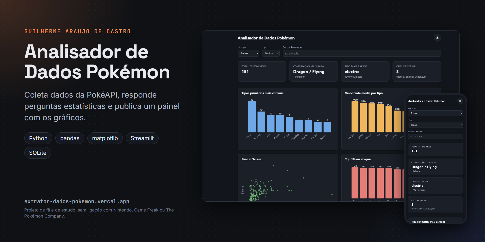
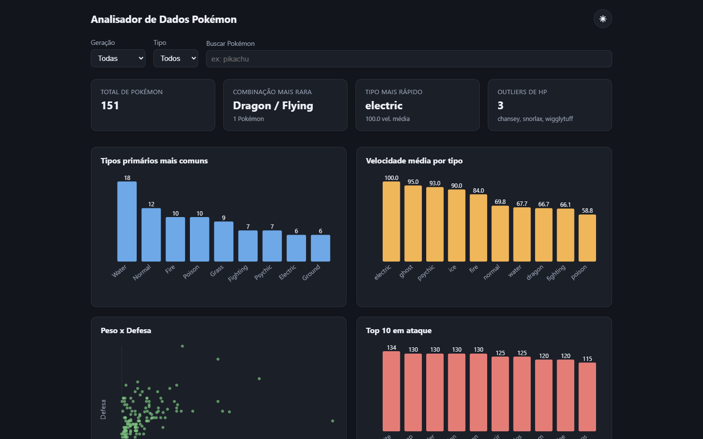
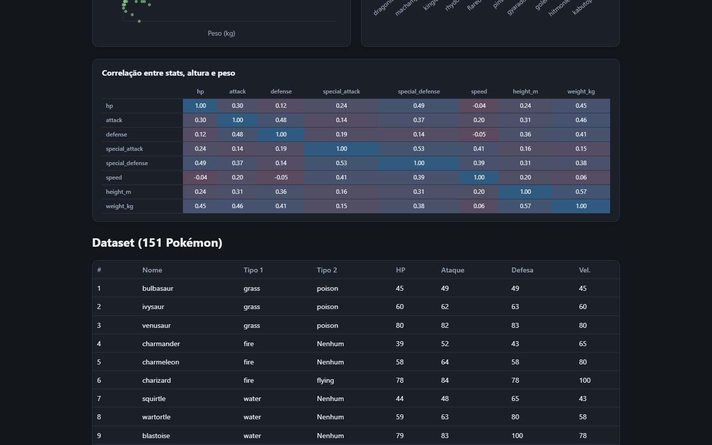
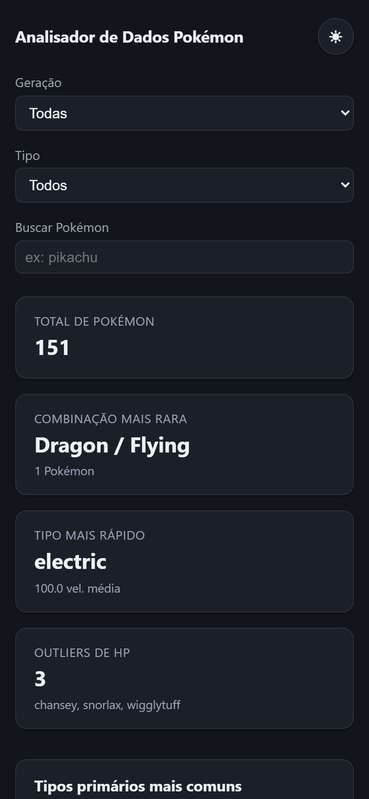

# Analisador de Dados Pokémon



[](https://github.com/GuilhermeAraujoDeCastro/pokemon-data-analyzer/actions/workflows/verificacao.yml)

Script em Python que junta dados de Pokémon (da PokéAPI ao vivo ou de um CSV salvo), organiza tudo numa tabela e responde perguntas estatísticas: qual combinação de tipos é mais rara, qual tipo é mais rápido na média, se peso e defesa andam juntos, quem se destaca em cada atributo. Gera gráficos, um relatório em HTML, JSON pro site e, se quiser, um banco SQLite. É o terceiro projeto da minha trilogia Pokémon, depois do [Simulador de Batalha](https://github.com/GuilhermeAraujoDeCastro/pokemon-battle-simulator) em Python e do [Team Builder](https://github.com/GuilhermeAraujoDeCastro/pokemon-team-builder) em C#.

Site com os gráficos: https://extrator-dados-pokemon.vercel.app

| Painel | Correlações e tabela | No celular |
|---|---|---|
|  |  |  |

## Como configurar

```bash
python -m venv .venv
.venv\Scripts\activate            # no Linux: source .venv/bin/activate
pip install -r requirements.txt
```

## Como rodar

Sem argumento nenhum, o script usa o CSV de exemplo que vem no projeto (20 Pokémon, sem internet):

```bash
python run_extractor.py
```

Ele imprime o relatório no terminal e salva os gráficos em `charts/`, em PNG e SVG. Pra buscar os dados direto da PokéAPI:

```bash
python run_extractor.py --source api --limit 151
```

`--limit 151` pega a Pokédex de Kanto inteira. O dataset baixado fica salvo em `data/pokemon_data.csv` e as respostas da API ficam num cache local (`.pokecache/`), então a próxima rodada não precisa da rede.

Opções:

| Opção | O que faz |
| --- | --- |
| `--source api` ou `csv` | de onde vêm os dados (padrão: `csv`) |
| `--input arquivo.csv` | CSV de entrada |
| `--limit N` | quantos Pokémon buscar na API |
| `--generation N` | filtra por geração (1 a 9) |
| `--type fire` | filtra por tipo, primário ou secundário |
| `--compare-input outro.csv` e `--compare-label Nome` | compara dois datasets lado a lado nos gráficos e no relatório |
| `--charts-dir pasta` ou `--no-charts` | onde salvar os gráficos, ou pular essa parte |
| `--html-report relatorio.html` | relatório em HTML num arquivo só, com os gráficos embutidos |
| `--export-json pasta` | grava `pokemon.json` e `report.json` (é o que o site usa) |
| `--sqlite-db banco.db` | exporta o dataset pra SQLite, útil pra ligar no Power BI |
| `--interactive` | pergunta as opções no terminal em vez de usar flags |
| `--verbose` | mostra o log de cache e rede |

Os gráficos só são refeitos quando o dataset muda.

## O que o script responde

Com o CSV de exemplo:

```
Combinacao de tipos mais rara: Dragon / Flying (1 Pokemon)
Tipo primario com maior velocidade media: psychic (125.0)
Correlacao entre peso e defesa: 0.465
```

Nesses 20, só o Dragonite tem a combinação Dragão/Voador, os psíquicos (Mewtwo e Alakazam) são os mais rápidos na média, e peso e defesa têm uma correlação positiva moderada. O Onix é a exceção: leve pro tamanho e com a maior defesa da lista.

Além disso, o relatório traz a correlação entre altura e HP, o tipo mais comum por geração, a matriz de correlação entre os atributos (em gráfico) e os Pokémon com HP fora da curva.

O CSV de exemplo foi digitado à mão, com Pokémon conhecidos (iniciais, lendários e clássicos como Snorlax, Ditto e Magikarp). Serve pro script funcionar sem internet. Pra tirar conclusão de verdade, use `--source api`: 20 Pokémon é pouco pra estatística.

## Dashboard em Streamlit

```bash
pip install -r requirements-dashboard.txt
streamlit run dashboard_streamlit.py
```

Mostra a mesma análise num painel local, com filtros.

## Site

A pasta `site/` tem um painel estático com os gráficos (SVG desenhado no próprio código, sem biblioteca), filtros por geração, tipo e nome, a tabela completa e tema claro e escuro. Ele lê o `site/data/pokemon.json` e o `site/data/report.json` gerados pelo `--export-json`.

```bash
cd site
npm install
npm run build
```

O build junta e ofusca o JavaScript em `site/dist/`, que é a pasta publicada na Vercel (veja o `vercel.json` na raiz).

O GitHub Actions roda o analisador com o CSV de exemplo e faz o build do site a cada push.

## Arquitetura

```
run_extractor.py        linha de comando: junta tudo, imprime o relatório e gera as saídas
dashboard_streamlit.py  painel local opcional
pokedata/
  fetch_api.py          busca lista e detalhes na PokéAPI
  cache.py              cache local das respostas da API
  clean.py              JSON da API -> linha da tabela (tipos, atributos, altura em m, peso em kg)
  dataset.py            monta o DataFrame e lê/grava o CSV
  generations.py        geração de cada Pokémon pelo número da Pokédex
  analysis.py           as perguntas estatísticas
  charts.py             gráficos em PNG e SVG
  html_report.py        relatório HTML num arquivo só
  json_export.py        pokemon.json e report.json
  sql_export.py         exportação pra SQLite
site/                   painel estático publicado na Vercel
data/sample_pokemon.csv dataset de exemplo
```

Cada etapa (buscar, limpar, guardar, analisar, desenhar) é um módulo separado, ligado à anterior só por dados simples (dicts e DataFrame). Por isso a análise roda sem rede nem arquivo: basta entregar um DataFrame.

## O que eu treinei com esse projeto

pandas pra limpar, organizar e agregar dados (groupby, correlação, rankings), matplotlib pra transformar isso em gráfico, consumo de uma API REST pública com paginação e cache, e exportação pra SQL como ponte pra ferramentas de dashboard. É o projeto mais parecido com o trabalho de análise de dados do certificado de Power BI, só que em Python.

## Créditos e avisos

Os dados vêm da [PokéAPI](https://pokeapi.co/). Pokémon é marca da Nintendo, da Game Freak e da The Pokémon Company. Este é um projeto de fã e de estudo, sem fins lucrativos e sem ligação com essas empresas.

## Licença e contato

Código sob a licença MIT (veja [LICENSE](LICENSE)). Feito por Guilherme Araujo de Castro: [portfólio](https://guilhermearaujodecastro.vercel.app) · [LinkedIn](https://www.linkedin.com/in/guilherme-araujo-de-castro) · guilhermeacastro.2006@gmail.com
